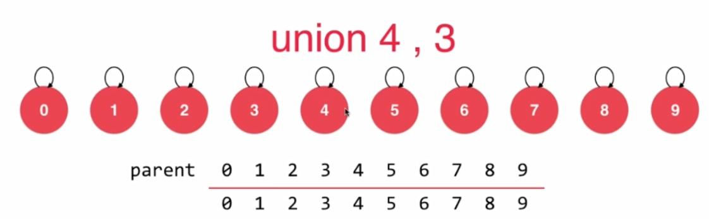
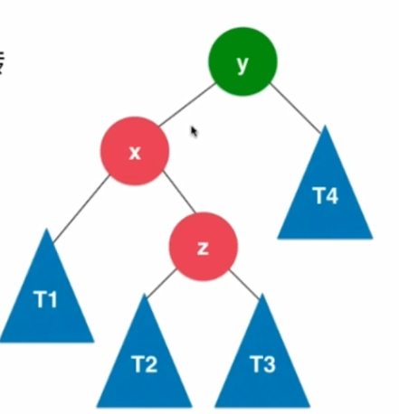
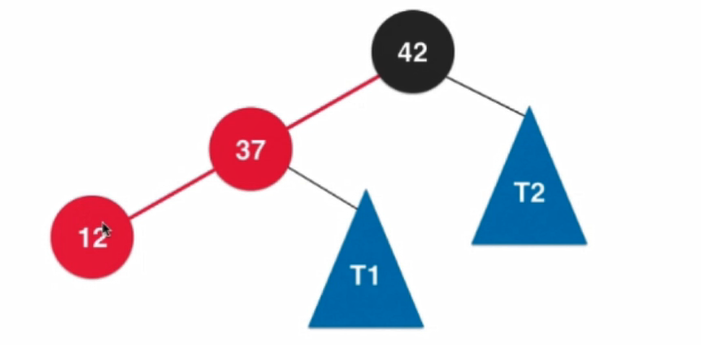

# algorithm

## 数组

- 把数据码成一排进行存放

  

- 数组最大的有点：快速查询。
- 数组最好应用于“索引有语义”的情况，但并非所有有语意的索引都适用于数组。（例如，身份证号）

### 向数组末尾添加元素


```java
data[size] = e;
size++
```
### 向数组指定位置添加元素


```java
data[size] = data[size-1];
data[size-1] = data[size-2];
...
data[index] = e;
size++
```

### 获取指定索引元素

### 更新指定索引元素

### 查找数组中是否有某元素

### 查找数组中某元素索引

### 删除指定位置元素


```java
data[index] = data[index +1 ];
data[index + 1] = data[index + 2];
...
data[size-2] = data[size-1];
size--;
```

### 动态数组

- 原来数组空间不够，增加数组容量
  
  
  
  
  

```java
resize(newCapacity);
E[] newData = (E[])new Object[newCapacity];
data = newData;
```

### 分析动态数组的时间复杂度

- 添加操作(O(n))

  addLast(e);	 O(1)

  addFirst(e);	 O(1)

  add(e);		    O(n)

  最坏情况需要rezise(). O(n)

- 删除操作(O(n))

  removeLast(e); 		O(1)
  
  removeFirst(e);		O(n)
  
  remove(e);				O(n)
  
  最坏情况需要rezise(). O(n)
  
- 修改操作(O(1))

  set(index, e);		O(1)

- 查找操作

  get(index) 			O(1)

  contains(e)			O(n)

  find(e)					O(n)

#### 均摊复杂度

- resize的复杂度分析

  假设capacity = n ，n+1次addLast，触发resize，总共进行2n+1次基本操作，平均，每次addLast操作，进行2次基本操作。这样均摊计算，时间复杂度是O(1)。

  addLast和removeLast，均摊复杂度为O(1)
#### 复杂度震荡

- addLast扩容后，调用remove，缩容，再addLast扩容，此时复杂度为O(n)；
- 解决方法：Lazy
- size == capacity/4时，才将capacity减半

​	

## 栈

- 栈是一种线性结构
- 相比数组，栈对应的操作是数组的子集
- 只能从一端添加元素，也只能从一端取出元素
- 这一端称为栈顶


- 栈是一种后进先出的数据结构（LIFO）

### 栈的应用

- Undo操作
- 程序调用系统栈

## 队列

- 队列是一种线性结构

- 相比数组，队列对应的操作是数组的子集

- 只能从一端（队尾）添加元素，只能从另一端（队首）取出元素
  

  ### 数组队列的复杂度分析
  
   入队		 			enqueue(E)			O(1) 
  
   出队 					dequeue()	  		O(n)
  
  查看队首元素		 front()					O(1)
  
  - 出队O(n)复杂度原因：移除队首元素，所有元素需要前移一位
  
  - 解决出队O(n)复杂度方法：循环队列
  
  ### 循环队列
  
  
  
  
  
  
  
  
  
  
  ### 循环队列的复杂度分析
  
  入队		 			enqueue(E)			O(1) 
  
   出队 					dequeue()	  		O(1)（均摊）
  
  查看队首元素		 front()					O(1)

## 链表

- 最简单的动态数据结构

- 数据存储在“节点”中

  ```java
  class Node{
      E e;
      Node next;
  }
  ```
  

- 优点：真正的动态，不需要处理固定容量的问题

- 缺点：丧失了随机访问的能力

- 最大的优点：动态

  ### 在链表头添加元素

   
  
   
  
   ```java
  node.next = head;
  head = node;
   ```
  
  ### 在链表中间添加元素
  
  
  
  
  
  
  
  
  ```java
  node.next = prev.next;
  prev.next = node;
  ```
  
  ### 链表虚拟头节点
  
  
  
  ```java
  Node dummyHead = new Node(null);
  ```
  
  ### 删除元素
  
  
  
  
  
  
  ```java
  prev.next = delNode.next;
  delNode.next = null;
  ```
  
  ### 链表复杂度分析
  
  增加	O(n)
  
  删除	O(n)
  
  修改	O(n)
  
  查找    O(n)

## 二叉树

- 和链表一样，动态数据结构


## 二分搜素树

- 二分搜素树是二叉树
- 二分搜素树的每个节点的值
  - 大于其左子树的所有节点的值
  - 小于其右子树的所有节点的值
- 存储的元素必须有可比较性


### 添加元素


### 遍历操作
- 对于遍历操作

  - 前序遍历（递归）

  ```java
  function traverse(node){
      if(node == null){
          return;
      }
      访问该节点
  	traverse(node.left);
  	traverse(node.right);
  }
  
  ```

  - 前序遍历（非递归）
  
	 
	
	 
	
	 
	
	 
  
  
  
  ```java
stack.push(root);
  while (!stack.isEmpty()) {
    Node cur = stack.pop();
      // 访问该节点
      if (cur.right != null) {
          stack.push(cur.right);
      }
      if (cur.left != null) {
          stack.push(cur.left);
      }
  }
  ```
  

  

  
  - 中序遍历
  
  ```java
  function traverse(node){
      if(node == null){
          return;
      }
  	traverse(node.left);
      访问该节点
	traverse(node.right);
  }
  ```
```
  
  - 后序遍历
  
  ```java
    function traverse(node){
        if(node == null){
            return;
        }
    	traverse(node.left);
    	traverse(node.right);
        访问该节点
    }
```

  - 层序遍历
  
    
    
    
    
    
    
    
  
    ```java
    queue.add(root);
    while (!queue.isEmpty()) {
        Node cur = queue.remove();
        访问该节点
        if (cur.left != null) {
            queue.add(cur.left);
        }
        if (cur.right != null) {
            queue.add(cur.right);
        }
    }
    ```
    
    ### 删除节点
    
    - 删除最小值
    
    
    
    
    
    
    
    
    
    
    - 删除任意值
     
    
     
    
     
    
     
    
     
    
    - 删除左右都有孩子的节点d
    - 找到s=min(d->right)
    - s是d的后继
    - s->right = delMin(d->right)
    - s-left = d->left
    - 删除d,s是新的子树的根
    
    
    
    ## 集合
    
    - Set
    - 不能添加重复元素
    
    ### 有序和无序集合
    
    - 有序集合基于搜索树实现
    - 无序集合基于哈希表实现
    
    ### 复杂度分析
    
    ​			LinkedListSet			BSTSet
    
    增			O(n)						O(h)	[ O(logn) ~ O(n) ]	
    
    删			O(n)						O(h)	[ O(logn) ~ O(n) ]	
    
    查			O(n)						O(h)	[ O(logn) ~ O(n) ]	
    
    最佳情况：h = log2(n+1)
    
    最差情况：n = h
    
    
    
    
    
    ## 映射
    
    - Map
    - 存储（键，值）数据对的数据结果（Key，Value）
    - 根据键（Key），寻找值（Value）
    
    
    
    ### 有序和无序映射
    
    - 有序映射基于搜索树实现
    - 无序映射基于哈希表实现
    
    
    
    ### 复杂度分析
    
    ​			LinkedListSet			BSTSet
    
    增			O(n)						O(h)	[ O(logn) ~ O(n) ]	
    
    删			O(n)						O(h)	[ O(logn) ~ O(n) ]	
    
    查			O(n)						O(h)	[ O(logn) ~ O(n) ]	
    
    最佳情况：h = log2(n+1)
    
    最差情况：n = h
    
    
    

## 优先队列

- 普通队列：先进先出；后进后出

- 优先队列：出队顺序和入队顺序无关；和优先级相关

- 动态选择优先级最高的任务执行

  ​        						入队			出队

​		普通线性结构        O(1)              O(n)

​		顺序线性结构        O(n)              O(1)

​		堆						O(logn)		   O(logn)

## 堆


- 二叉堆是一棵完全二叉树

- 堆中某个节点的值总是不大于其父节点的值（最大堆）

  最大堆
  
  
  ```java
  parent(i) = i /2 
  left chid (i) = 2 * i;
  right child (2) = 2 * i + 1;
  ```
  
  ### 添加元素
  
   
  
   
  
   
  
   
  
  ### 取出元素
  
  
  
  
  
  
  

### 将任意数组整理成堆

- heapify

- 从最后一个非叶子结点开始siftDown
  

  

  

  

  

  
  
  
  
  

  

  
  
  
  
  

  
  

## 线段树

- 线段树不是完全二叉树
- 线段树是平衡二叉树（堆也是）
- 如果区间有N个元素，数组表示需要4n个节点


### 查询


​								使用数组实现		使用线段树

​				更新				O(n)					O(logn)

​				查询				O(n)					O(logn)

## 前缀树

- Trie
- 每个节点有若干向下个节点的指针


## 并查集

### 数组实现


#### 查找

```java
id[p]
```

#### 查看是否连接

```java
id[p] == id[q]
```

#### 合并


```java
int pId = find(p);
int qId = find(q);
if (pId == qId) {
    return;
}

for (int i = 0; i < id.length; i++) {
    if (id[i] == qId) {
        id[i] = pId;
    }
}
```

### 树实现


#### 查找（根节点）

```java
int root = parent[p];
while(root != p){
   root =parent[root];
}
return root;
```

#### 查看是否连接

```java
find(p) == find(q);
```

#### 合并



```java
int pRoot = find(p);
int qRoot = find(q);

if (pRoot == qRoot) {
    return;
}

parent[pRoot] = qRoot;
```

#### 路径压缩


## AVL树

- 最早的自平衡二分搜素树结构
- 平衡二叉树
  - 对于任意一个节点，左右子树高度差不超过1
- 高度和节点数量之间的关系也是O(logn)
- 标注节点的高度，计算平衡因子（左右节点高度差）

### 平衡维护

- 添加节点的时候维护


#### 右旋转(RR)


#### 左旋转(LL)


#### 左旋转 + 右旋转 (LR)



- 转化成了LL的情况


#### 右旋转 + 左旋转 (RL)


- 转化成了RR的情况


### 删除元素

- 删除之后，跟添加元素一样，判断一下平衡因子

## 红黑树

- 每个节点或者是红色，或者是黑色的
- 根节点是黑色的
- 每一个叶子节点是黑色的
- 如果一个节点是红色的，那么他的孩子节点都是黑色的
- 从任意一个节点到叶子节点，经过的黑色节点是一样的

### 2-3树

- 满足二分搜素树的基本性质

- 节点可以存放一个元素或两个元素


- 2-3树是一棵绝对平衡的树


- 2-3树与红黑树


### 红黑树添加元素
- 左旋转
    

    

    

    
    
```java
node.right = x.left;
x.left = node;
x.color = node.color;
node.color = RED;
```

- 颜色翻转
 	

    
    
    

- 右旋转

   
   
   
   
   
   
   

```java
node.left =T1;
x.right = node;
x.color = node.color;
node.color = RED;
```

### 添加元素
 

### 性能总结

- 对于完全随机的数据，普通二分搜素树很好用！
- 缺点：极端情况下退化成链表或高度不平衡
- 对于查询较多的使用情况，AVL树很好用！
- 红黑树牺牲了平衡性(2logn的高度)
- 统计性能更优（综合增删改查所有的操作）

## 哈希表

- 哈希表充分体现了算法设计领域的经典思想：空间换时间
- 哈希表是时间和空间之间的平衡
- 哈希函数的设计是很重要的
- “键”通过哈希函数得到的“索引”分布越均匀越好

### 哈希函数的设计（常用方法）

#### 原则

- 一致性：如果a==b 则hash(a) == hash(b)
- 高效性：计算高效简便
- 均匀性：哈希值均匀分布

#### 方法

- “键”通过哈希函数得到的“索引”分布越均匀越好

- 整型

  - 小范围正整数直接使用
  - 小范围负整数进行偏移
  - 大整数
    - 通过做法：取模
    - 简单的解决方法：模一个素数

- 浮点型：在计算机中都是32位或64位的二进制表示，只不过计算机解析成了浮点数，可以转换成整型处理

- 字符串：转成整型

- 复合类型：转成整型

### 哈希冲突的处理（链地址法）


